# Abhängigkeiten je Funktion

<!-- GENERIERT — nicht von Hand ändern. Quelle: src/lib/funktionsmodellRegistry.ts
     (`affects` je Stellschraube + FM_WIRED_EDGES) · neu erzeugen: `npm run funktionsmodell` -->

Für jede Mechanik: **was in sie hineinwirkt** und **worauf sie selbst wirkt**. Die Steckbriefe
beantworten die zweite Richtung in Prosa; diese Seite beantwortet vor allem die erste — die,
die man stellt, wenn sich etwas unerklärlich verhält.

Zwei Arten von Kanten, und der Unterschied ist wichtig:

- **Über ein Feld** — es gibt einen Schalter, den jemand gesetzt hat. Nachzuschlagen im
  [Stellschrauben-Register](stellschrauben.md).
- ***feste Regel*** — dahinter steht **kein** Schalter. Diese Kanten sind die, die im Betrieb
  überraschen: man sucht die Einstellung, die das verursacht hat, und es gibt keine.

Insgesamt 133 Kanten über 18 Mechaniken, davon 19 fest verdrahtet.

## Einträge

Steckbrief: [15-eintraege.md](15-eintraege.md)

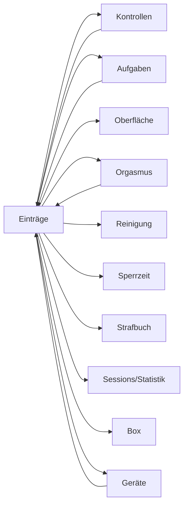

### Hängt ab von

| Woher | Wodurch | Was passiert | Anker |
|---|---|---|---|
| Kontrollen | `User.inspectionAutoMarkEnabled` | Stufe 2: bucht die unbeantwortete Kontrolle selbst als Öffnung bzw. Ablegen. Hebt dabei bewusst KEINE Sperrzeit auf. | `queries.ts:releaseSperrzeitenOnOpen` |
| Geräte | `DeviceCategory.trackingEnabled` | Aus = reine Inventar-Kategorie: keine Trage-Sessions, keine Statistik. Abwesenheit in den Auswertungen ist dann keine Nichtnutzung. Bei der eingebauten Kategorie unveränderlich. | `deviceCategoryService.ts:resolveCategoryRuleChanges` |
| Geräte | `DeviceCategory.requirePhoto` | Ein Trage-Beginn dieser Kategorie verlangt ein Bild. Bei der eingebauten Kategorie unveränderlich. | `deviceCategoryService.ts:resolveCategoryRuleChanges` |
| Orgasmus | `OrgasmusAnforderung.vorgegebeneArt` | Verlangt eine bestimmte Orgasmus-Art; leer = beliebig. Nur ein passender Eintrag erfüllt. | — |
| Aufgaben | `TaskRequirement.type` | `KG_LOCKED` (verschlossen bleiben) oder `WEAR` (etwas tragen). Der KG ist bewusst keine Trage-Kategorie. | — |
| Kontrollen | *feste Regel* | Eskalationsstufe 2 legt selbst einen Öffnen-Eintrag an — ohne Zutun des Subs und ohne dass die Box aufgeht. Eine Sperrzeit hebt sie dabei bewusst nicht auf. | `inspectionEscalationService.ts` |
| Geräte | *feste Regel* | Das massgebliche Gerät eines Segments ist das EFFEKTIVE: bei einem Konflikt zwischen Bild und Deklaration gewinnt das Bild — ausser innerhalb eines Lookalike-Clusters. | `sessionModel.ts:effectiveDevice` |
| Aufgaben | *feste Regel* | Die Bedingungen einer Aufgabe werden bei jedem Lesen aus den Einträgen abgeleitet. Ein nachgetragener Eintrag korrigiert die Aufgabe von selbst; es gibt nichts zu bestätigen. | `tasks.ts` |

### Wirkt auf

| Wohin | Wodurch | Was passiert | Anker |
|---|---|---|---|
| Kontrollen | `User.mobileDesktopUpload` | Erlaubt auf Mobilgeräten die Dateiauswahl statt nur die Kamera — schwächt jeden Foto-Nachweis, deshalb Admin-Feld. | — |
| Aufgaben | `User.mobileDesktopUpload` | Erlaubt auf Mobilgeräten die Dateiauswahl statt nur die Kamera — schwächt jeden Foto-Nachweis, deshalb Admin-Feld. | — |
| Oberfläche | `User.mobileDesktopUpload` | Erlaubt auf Mobilgeräten die Dateiauswahl statt nur die Kamera — schwächt jeden Foto-Nachweis, deshalb Admin-Feld. | — |
| Orgasmus | `User.orgasmusArtenConfig` | Auswahlliste der Orgasmus-Arten im Erfassungsformular (JSON). Leer = die eingebauten Arten. | `reasonsService.ts` |
| Reinigung | `User.oeffnenGruendeConfig` | Auswahlliste der Öffnungsgründe. `REINIGUNG` ist der Grund, an dem die gesamte Reinigungslogik hängt — er lässt sich nicht wegkonfigurieren. | `reasonsService.ts` |
| Sperrzeit | `User.oeffnenGruendeConfig` | Auswahlliste der Öffnungsgründe. `REINIGUNG` ist der Grund, an dem die gesamte Reinigungslogik hängt — er lässt sich nicht wegkonfigurieren. | `reasonsService.ts` |
| Reinigung | `Entry.oeffnenGrund` | Grund einer Öffnung. `REINIGUNG` ist der eine Wert, an dem die gesamte Reinigungsmechanik hängt — er entscheidet, ob die Sperrzeit fällt. | `queries.ts:isAllowedCleaningOpen` |
| Sperrzeit | `Entry.oeffnenGrund` | Grund einer Öffnung. `REINIGUNG` ist der eine Wert, an dem die gesamte Reinigungsmechanik hängt — er entscheidet, ob die Sperrzeit fällt. | `queries.ts:isAllowedCleaningOpen` |
| Strafbuch | `Entry.oeffnenGrund` | Grund einer Öffnung. `REINIGUNG` ist der eine Wert, an dem die gesamte Reinigungsmechanik hängt — er entscheidet, ob die Sperrzeit fällt. | `queries.ts:isAllowedCleaningOpen` |
| Sessions/Statistik | `Entry.oeffnenGrund` | Grund einer Öffnung. `REINIGUNG` ist der eine Wert, an dem die gesamte Reinigungsmechanik hängt — er entscheidet, ob die Sperrzeit fällt. | `queries.ts:isAllowedCleaningOpen` |
| Box | `Entry.keyInBox` | Erklärung beim Verschluss, ob der Schlüssel in die Box wandert. `false` = er behält ihn, die Box bekommt bewusst KEIN Sperr-Kommando. `null` = nicht gefragt. | `boxCommand.ts` |
| Sperrzeit | `Entry.keyInBox` | Erklärung beim Verschluss, ob der Schlüssel in die Box wandert. `false` = er behält ihn, die Box bekommt bewusst KEIN Sperr-Kommando. `null` = nicht gefragt. | `boxCommand.ts` |
| Geräte | `Entry.deviceId` | Welches Gerät der Eintrag betrifft. Bei einem Konflikt mit dem Bild gewinnt das Bild, nicht diese Deklaration. | — |
| Sessions/Statistik | `Entry.deviceId` | Welches Gerät der Eintrag betrifft. Bei einem Konflikt mit dem Bild gewinnt das Bild, nicht diese Deklaration. | — |
| Kontrollen | `Entry.deviceId` | Welches Gerät der Eintrag betrifft. Bei einem Konflikt mit dem Bild gewinnt das Bild, nicht diese Deklaration. | — |
| Sessions/Statistik | `Entry.startTime` | Der Zeitpunkt, den der Eintrag behauptet. Auf dem Sub-Pfad gegen Rückdatierung begrenzt, auf dem Keyholder-Pfad frei — dort erfüllt ein Nachtrag nur, was es zu seinem Zeitpunkt schon gab. | `entryFulfilment.ts` |
| Strafbuch | `Entry.startTime` | Der Zeitpunkt, den der Eintrag behauptet. Auf dem Sub-Pfad gegen Rückdatierung begrenzt, auf dem Keyholder-Pfad frei — dort erfüllt ein Nachtrag nur, was es zu seinem Zeitpunkt schon gab. | `entryFulfilment.ts` |
| Sperrzeit | *feste Regel* | Eine Öffnung ohne Deckung hebt JEDE aktive Sperrzeit auf. Eine erlaubte Reinigungsöffnung und ein Orgasmus-Öffnungsfenster tun das nicht. | `queries.ts:releaseSperrzeitenOnOpen` |
| Sessions/Statistik | *feste Regel* | Sessions, Segmente und jede Stundenzahl entstehen beim LESEN aus den Einträgen. Nichts davon ist gestempelt — ein korrigierter Eintrag korrigiert alles Nachgelagerte mit. | `sessionModel.ts:buildSessions` |
| Kontrollen | *feste Regel* | Ein Prüfungs-Eintrag erfüllt nur die Kontrolle DESSELBEN Ziels; ein Plug-Foto hakt keine KG-Kontrolle ab. | `kontrolleService.ts` |
| Orgasmus | *feste Regel* | Ein passender Orgasmus-Eintrag im Fenster erfüllt die Direktive selbsttätig — passend heisst: die vorgegebene Art stimmt, sofern eine gesetzt ist. | `entryFulfilment.ts` |
| Box | *feste Regel* | Die Box folgt den Einträgen: aus Verschluss und Öffnen leitet der Tracker ihr Kommando ab. Eine VERBOTENE Öffnung bekommt keines — sonst vollzöge er das Vergehen, das er dokumentiert. | `boxCommand.ts` |

## Sperrzeit

Steckbrief: [10-sperrzeit.md](10-sperrzeit.md)

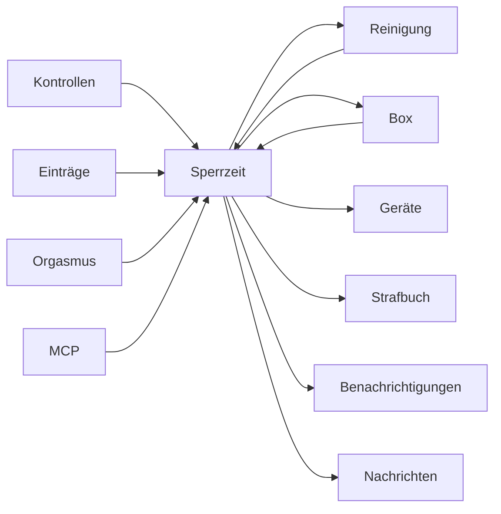

### Hängt ab von

| Woher | Wodurch | Was passiert | Anker |
|---|---|---|---|
| Reinigung | `User.reinigungErlaubt` | Ob Reinigungspausen überhaupt erlaubt sind. Notwendig, nicht hinreichend — eine aktive Sperrzeit muss es zusätzlich erlauben. | `queries.ts:cleaningBlockReason` |
| Kontrollen | `User.autoKontrolleNurBeiSperre` | Stellt den Tagesplan nur während einer laufenden Sperrzeit zu. Gilt NICHT für die Kontrolle nach dem Wiederverschluss. | `autoKontrolleService.ts` |
| Einträge | `User.oeffnenGruendeConfig` | Auswahlliste der Öffnungsgründe. `REINIGUNG` ist der Grund, an dem die gesamte Reinigungslogik hängt — er lässt sich nicht wegkonfigurieren. | `reasonsService.ts` |
| Einträge | `Entry.oeffnenGrund` | Grund einer Öffnung. `REINIGUNG` ist der eine Wert, an dem die gesamte Reinigungsmechanik hängt — er entscheidet, ob die Sperrzeit fällt. | `queries.ts:isAllowedCleaningOpen` |
| Einträge | `Entry.keyInBox` | Erklärung beim Verschluss, ob der Schlüssel in die Box wandert. `false` = er behält ihn, die Box bekommt bewusst KEIN Sperr-Kommando. `null` = nicht gefragt. | `boxCommand.ts` |
| Orgasmus | `OrgasmusAnforderung.oeffnenErlaubt` | Erlaubt das Öffnen im Fenster, ohne dass es als unautorisiert zählt — der einzige Weg, eine Sperrzeit gezielt zu durchbrechen. | — |
| MCP | `HealthHold.active` | Gesundheits-Halt: setzt die Direktiven aus. Die eine Bremse, die über allem steht. | — |
| MCP | `RecurringContext.deviceFree` | Der Slot verlangt Gerätefreiheit — die Information, wegen der der Keyholder ihn überhaupt führt. | — |
| MCP | `Appointment.deviceFree` | Der Termin verlangt Gerätefreiheit. | — |
| Einträge | *feste Regel* | Eine Öffnung ohne Deckung hebt JEDE aktive Sperrzeit auf. Eine erlaubte Reinigungsöffnung und ein Orgasmus-Öffnungsfenster tun das nicht. | `queries.ts:releaseSperrzeitenOnOpen` |
| Box | *feste Regel* | Die Failsafes (leerer Akku, zu lange offline, absolutes Hard-Cap) öffnen physisch auch gegen eine laufende Sperrzeit und gegen den Keyholder. Der Tracker-Zustand ändert sich dabei NICHT — beide laufen dann auseinander. | `boxOpenOutlook.ts` |

### Wirkt auf

| Wohin | Wodurch | Was passiert | Anker |
|---|---|---|---|
| Reinigung | `VerschlussAnforderung.reinigungErlaubt` | Erlaubt DIESE Sperrzeit eine Reinigungsöffnung (und damit einen Gerätewechsel)? Es müssen ALLE gleichzeitig aktiven Sperrzeiten erlauben, nicht nur die neueste. | `queries.ts:foldActiveSperrzeiten` |
| Box | `VerschlussAnforderung.reinigungErlaubt` | Erlaubt DIESE Sperrzeit eine Reinigungsöffnung (und damit einen Gerätewechsel)? Es müssen ALLE gleichzeitig aktiven Sperrzeiten erlauben, nicht nur die neueste. | `queries.ts:foldActiveSperrzeiten` |
| Geräte | `VerschlussAnforderung.reinigungErlaubt` | Erlaubt DIESE Sperrzeit eine Reinigungsöffnung (und damit einen Gerätewechsel)? Es müssen ALLE gleichzeitig aktiven Sperrzeiten erlauben, nicht nur die neueste. | `queries.ts:foldActiveSperrzeiten` |
| Box | `VerschlussAnforderung.endetAt` | Bei einer SPERRZEIT das Ende (leer = unbefristet), bei einer ANFORDERUNG die Frist zum Einschliessen. | `queries.ts:foldActiveSperrzeiten` |
| Strafbuch | `VerschlussAnforderung.endetAt` | Bei einer SPERRZEIT das Ende (leer = unbefristet), bei einer ANFORDERUNG die Frist zum Einschliessen. | `queries.ts:foldActiveSperrzeiten` |
| Geräte | `VerschlussAnforderung.deviceId` | Verlangt ein bestimmtes Gerät. Nur hieraus entsteht das Vergehen „falsches Gerät“ — der Bild-Abgleich allein tut es nie. | — |
| Strafbuch | `VerschlussAnforderung.deviceId` | Verlangt ein bestimmtes Gerät. Nur hieraus entsteht das Vergehen „falsches Gerät“ — der Bild-Abgleich allein tut es nie. | — |
| Benachrichtigungen | `VerschlussAnforderung.wirksamAb` | Terminierte Auslösung. Bis dahin existiert die Direktive für den Sub nicht: keine Anzeige, keine Meldung, keine laufende Frist. | — |
| Nachrichten | `VerschlussAnforderung.nachricht` | Begleittext an den Sub; erscheint in der Meldung und im Posteingang. | — |
| Box | *feste Regel* | Läuft eine Sperrzeit, hält die Box den Schlüssel fest. Die Sperre ist damit mehr als ein Datenbank-Eintrag. | `boxCommand.ts` |

## Reinigung

Steckbrief: [20-reinigung.md](20-reinigung.md)

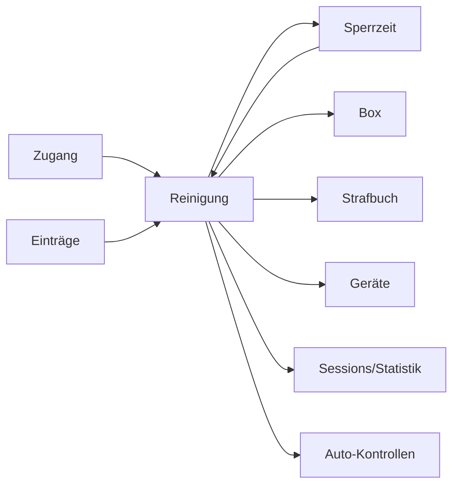

### Hängt ab von

| Woher | Wodurch | Was passiert | Anker |
|---|---|---|---|
| Zugang | `User.timezone` | Die Wanduhr des Subs. Kalendertag, Reinigungsfenster und Schlaf-Fenster rechnen darin — nicht in der Serverzone. Historisiert: eine Umstellung wirkt ab jetzt, vergangene Öffnungen bleiben nach der damaligen Zone beurteilt. | `timezoneRules.ts:timezoneRulesFrom` |
| Einträge | `User.oeffnenGruendeConfig` | Auswahlliste der Öffnungsgründe. `REINIGUNG` ist der Grund, an dem die gesamte Reinigungslogik hängt — er lässt sich nicht wegkonfigurieren. | `reasonsService.ts` |
| Sperrzeit | `VerschlussAnforderung.reinigungErlaubt` | Erlaubt DIESE Sperrzeit eine Reinigungsöffnung (und damit einen Gerätewechsel)? Es müssen ALLE gleichzeitig aktiven Sperrzeiten erlauben, nicht nur die neueste. | `queries.ts:foldActiveSperrzeiten` |
| Einträge | `Entry.oeffnenGrund` | Grund einer Öffnung. `REINIGUNG` ist der eine Wert, an dem die gesamte Reinigungsmechanik hängt — er entscheidet, ob die Sperrzeit fällt. | `queries.ts:isAllowedCleaningOpen` |

### Wirkt auf

| Wohin | Wodurch | Was passiert | Anker |
|---|---|---|---|
| Sperrzeit | `User.reinigungErlaubt` | Ob Reinigungspausen überhaupt erlaubt sind. Notwendig, nicht hinreichend — eine aktive Sperrzeit muss es zusätzlich erlauben. | `queries.ts:cleaningBlockReason` |
| Box | `User.reinigungErlaubt` | Ob Reinigungspausen überhaupt erlaubt sind. Notwendig, nicht hinreichend — eine aktive Sperrzeit muss es zusätzlich erlauben. | `queries.ts:cleaningBlockReason` |
| Strafbuch | `User.reinigungErlaubt` | Ob Reinigungspausen überhaupt erlaubt sind. Notwendig, nicht hinreichend — eine aktive Sperrzeit muss es zusätzlich erlauben. | `queries.ts:cleaningBlockReason` |
| Geräte | `User.reinigungErlaubt` | Ob Reinigungspausen überhaupt erlaubt sind. Notwendig, nicht hinreichend — eine aktive Sperrzeit muss es zusätzlich erlauben. | `queries.ts:cleaningBlockReason` |
| Strafbuch | `User.reinigungMaxMinuten` | Höchstdauer EINER Pause. Darüber hinaus zählt die Pause als Tragezeit-Unterbrechung und wird zum erkannten Vergehen. | `cleaningRules.ts:reinigungRulesAt` |
| Sessions/Statistik | `User.reinigungMaxMinuten` | Höchstdauer EINER Pause. Darüber hinaus zählt die Pause als Tragezeit-Unterbrechung und wird zum erkannten Vergehen. | `cleaningRules.ts:reinigungRulesAt` |
| Strafbuch | `User.reinigungMaxProTag` | ANZAHL Öffnungen pro Kalendertag des Subs (kein Minutenbudget). 0 = unbegrenzt. Wird nur erkannt, nie durchgesetzt. | `reinigungService.ts:maxPausesPerDaySentinel` |
| Box | `User.reinigungsFenster` | Tages-Zeitfenster (JSON-Liste). Binden NUR während einer Sperrzeit, die die Reinigung erlaubt. Leere Liste = nicht zeitgebunden, kein Verbot. | `queries.ts:cleaningWindowBindingStatus` |
| Auto-Kontrollen | *feste Regel* | Jeder SELBST erfasste Wiederverschluss nach einer Reinigungspause erzeugt eine Kontrolle (15–45 min, im Schlaf-Fenster 5–15). Sie ersetzt die nächste noch nicht zugestellte Auto-Kontrolle des Tages. Feste Regel, keine Einstellung — nur der Hauptschalter der Automatik schaltet sie ab. | `autoKontrolleService.ts:scheduleCleaningRelockInspection` |
| Sessions/Statistik | *feste Regel* | Eine Pause zerlegt die KG-Session in Segmente und wird von der Tragedauer abgezogen — die Session bricht dabei nicht. | `sessionModel.ts:buildSessions` |
| Geräte | *feste Regel* | Es gibt keinen eigenen Gerätewechsel: er läuft über eine Reinigungsöffnung und verbraucht damit deren Tageskontingent. | — |

## Kontrollen

Steckbrief: [30-kontrollen.md](30-kontrollen.md)

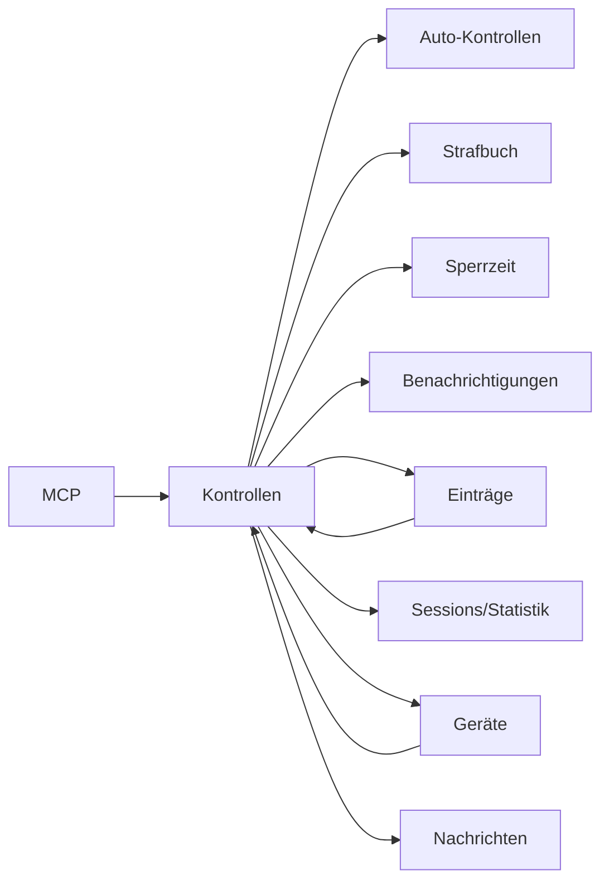

### Hängt ab von

| Woher | Wodurch | Was passiert | Anker |
|---|---|---|---|
| Einträge | `User.mobileDesktopUpload` | Erlaubt auf Mobilgeräten die Dateiauswahl statt nur die Kamera — schwächt jeden Foto-Nachweis, deshalb Admin-Feld. | — |
| Geräte | `Device.categoryId` | Zuordnung zur Kategorie — entscheidet, welche Kategorie-Regeln (Tracking, Pflichtfoto, Trainingsziele) für dieses Gerät gelten. | `deviceCategoryService.ts:resolveOwnedCategory` |
| Einträge | `Entry.deviceId` | Welches Gerät der Eintrag betrifft. Bei einem Konflikt mit dem Bild gewinnt das Bild, nicht diese Deklaration. | — |
| MCP | `HealthHold.active` | Gesundheits-Halt: setzt die Direktiven aus. Die eine Bremse, die über allem steht. | — |
| Einträge | *feste Regel* | Ein Prüfungs-Eintrag erfüllt nur die Kontrolle DESSELBEN Ziels; ein Plug-Foto hakt keine KG-Kontrolle ab. | `kontrolleService.ts` |

### Wirkt auf

| Wohin | Wodurch | Was passiert | Anker |
|---|---|---|---|
| Auto-Kontrollen | `User.autoKontrolleAktiv` | Hauptschalter der Automatik. Aus schaltet BEIDES ab: den gewürfelten Tagesplan und die Kontrolle nach dem Wiederverschluss. | `autoKontrolleService.ts` |
| Strafbuch | `User.autoKontrolleAktiv` | Hauptschalter der Automatik. Aus schaltet BEIDES ab: den gewürfelten Tagesplan und die Kontrolle nach dem Wiederverschluss. | `autoKontrolleService.ts` |
| Auto-Kontrollen | `User.autoKontrollePerDayMin` | Untergrenze der pro Tag gewürfelten Anzahl. Zusammen mit Max auf 0 bleibt nur die Kontrolle nach dem Wiederverschluss. | `autoKontrolleService.ts:generateAutoKontrollen` |
| Auto-Kontrollen | `User.autoKontrollePerDayMax` | Obergrenze derselben Auslosung. Unter Min gesetzt wird er auf Min angehoben statt abgelehnt. | `autoKontrolleService.ts:clampPerDay` |
| Auto-Kontrollen | `User.autoKontrolleRuheVon` | Beginn des Schlaf-Fensters (Wanduhr des Subs). Darin wird weder ausgelöst noch eine Frist platziert. | `autoKontrolleService.ts:isInQuietMinutes` |
| Auto-Kontrollen | `User.autoKontrolleRuheBis` | Ende des Schlaf-Fensters. Das Komplement daraus ist das Wach-Fenster, über das der Tagesplan verteilt wird. | `autoKontrolleService.ts:awakeWindow` |
| Auto-Kontrollen | `User.autoKontrolleFristVon` | Untergrenze der Erfüllungsfrist je Kontrolle (Minuten). Bleibt sie vor dem Schlaf-Beginn nicht mehr ganz übrig, entfällt der Slot. | `autoKontrolleService.ts:windowDeadline` |
| Auto-Kontrollen | `User.autoKontrolleFristBis` | Obergrenze derselben Frist; je Kontrolle wird zufällig aus der Spanne gezogen. | `autoKontrolleService.ts:clampFrist` |
| Auto-Kontrollen | `User.autoKontrolleFensterVon` | Beginn eines optionalen festen Auslöse-Fensters. Leer = ganzes Wach-Fenster. Wrappt bewusst nicht über Mitternacht. | `autoKontrolleService.ts:fixedWindowMinutes` |
| Auto-Kontrollen | `User.autoKontrolleFensterBis` | Ende desselben Fensters. Liegt es vollständig im Schlaf-Fenster, wird die Kombination abgelehnt statt wirkungslos gespeichert. | `autoKontrolleService.ts:triggerWindowAllQuiet` |
| Auto-Kontrollen | `User.autoKontrolleNurBeiSperre` | Stellt den Tagesplan nur während einer laufenden Sperrzeit zu. Gilt NICHT für die Kontrolle nach dem Wiederverschluss. | `autoKontrolleService.ts` |
| Sperrzeit | `User.autoKontrolleNurBeiSperre` | Stellt den Tagesplan nur während einer laufenden Sperrzeit zu. Gilt NICHT für die Kontrolle nach dem Wiederverschluss. | `autoKontrolleService.ts` |
| Benachrichtigungen | `User.inspectionReminderEnabled` | Stufe 1: mahnt eine überfällige Kontrolle an. Setzt nur den Uhr-Anker für Stufe 2 — ohne sie beginnt Stufe 2 nie. | `inspectionEscalationService.ts` |
| Benachrichtigungen | `User.inspectionReminderDelayMinutes` | Verzug bis zur Mahnung, gemessen ab dem Ablauf der Kontroll-Frist. | `inspectionEscalationService.ts` |
| Einträge | `User.inspectionAutoMarkEnabled` | Stufe 2: bucht die unbeantwortete Kontrolle selbst als Öffnung bzw. Ablegen. Hebt dabei bewusst KEINE Sperrzeit auf. | `queries.ts:releaseSperrzeitenOnOpen` |
| Sessions/Statistik | `User.inspectionAutoMarkEnabled` | Stufe 2: bucht die unbeantwortete Kontrolle selbst als Öffnung bzw. Ablegen. Hebt dabei bewusst KEINE Sperrzeit auf. | `queries.ts:releaseSperrzeitenOnOpen` |
| Strafbuch | `User.inspectionAutoMarkEnabled` | Stufe 2: bucht die unbeantwortete Kontrolle selbst als Öffnung bzw. Ablegen. Hebt dabei bewusst KEINE Sperrzeit auf. | `queries.ts:releaseSperrzeitenOnOpen` |
| Geräte | `KontrollAnforderung.deviceId` | Verengt das Ziel auf genau ein Gerät und hat Vorrang vor der Kategorie. Es muss das getragene sein, sonst ist die Kontrolle nicht erfüllbar. | — |
| Strafbuch | `KontrollAnforderung.deadline` | Erfüllungsfrist. Nach Ablauf verschwindet die Kontrolle nicht, sie wird überfällig — und ist der Startpunkt der Eskalation. | `inspectionEscalationService.ts` |
| Auto-Kontrollen | `KontrollAnforderung.wirksamAb` | Terminierte Zustellung; bis dahin für den Sub unsichtbar und ohne laufende Frist. Auch der Weg, auf dem der Tagesplan vorab angelegt wird. | — |
| Nachrichten | `KontrollAnforderung.kommentar` | Begleittext an den Sub. | — |
| Einträge | *feste Regel* | Eskalationsstufe 2 legt selbst einen Öffnen-Eintrag an — ohne Zutun des Subs und ohne dass die Box aufgeht. Eine Sperrzeit hebt sie dabei bewusst nicht auf. | `inspectionEscalationService.ts` |
| Strafbuch | *feste Regel* | Versäumt, abgelehnt oder automatisch als abgenommen gebucht — in jedem Fall ein erkanntes Vergehen, unabhängig davon, ob die Eskalation eingeschaltet ist. | — |

## Orgasmus

Steckbrief: [35-orgasmus.md](35-orgasmus.md)

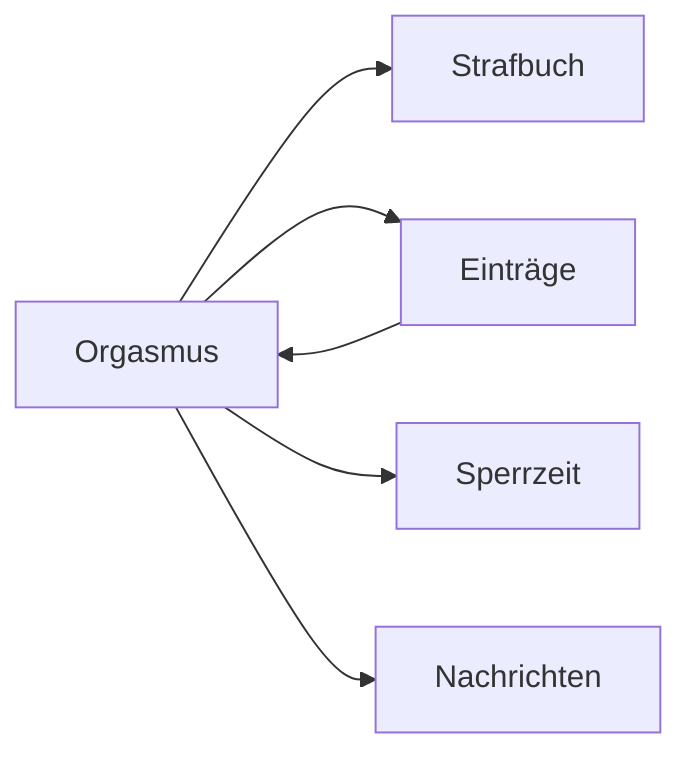

### Hängt ab von

| Woher | Wodurch | Was passiert | Anker |
|---|---|---|---|
| Einträge | `User.orgasmusArtenConfig` | Auswahlliste der Orgasmus-Arten im Erfassungsformular (JSON). Leer = die eingebauten Arten. | `reasonsService.ts` |
| Einträge | *feste Regel* | Ein passender Orgasmus-Eintrag im Fenster erfüllt die Direktive selbsttätig — passend heisst: die vorgegebene Art stimmt, sofern eine gesetzt ist. | `entryFulfilment.ts` |

### Wirkt auf

| Wohin | Wodurch | Was passiert | Anker |
|---|---|---|---|
| Strafbuch | `OrgasmusAnforderung.art` | ANWEISUNG = Pflicht (ungenutzt ist ein Vergehen), GELEGENHEIT = Erlaubnis (ungenutzt folgenlos). Der ganze Unterschied der Direktive. | — |
| Strafbuch | `OrgasmusAnforderung.endetAt` | Ende des Fensters. Danach ist eine ANWEISUNG versäumt. | — |
| Einträge | `OrgasmusAnforderung.vorgegebeneArt` | Verlangt eine bestimmte Orgasmus-Art; leer = beliebig. Nur ein passender Eintrag erfüllt. | — |
| Sperrzeit | `OrgasmusAnforderung.oeffnenErlaubt` | Erlaubt das Öffnen im Fenster, ohne dass es als unautorisiert zählt — der einzige Weg, eine Sperrzeit gezielt zu durchbrechen. | — |
| Strafbuch | `OrgasmusAnforderung.oeffnenErlaubt` | Erlaubt das Öffnen im Fenster, ohne dass es als unautorisiert zählt — der einzige Weg, eine Sperrzeit gezielt zu durchbrechen. | — |
| Nachrichten | `OrgasmusAnforderung.nachricht` | Begleittext an den Sub. | — |

## Aufgaben

Steckbrief: [40-aufgaben.md](40-aufgaben.md)

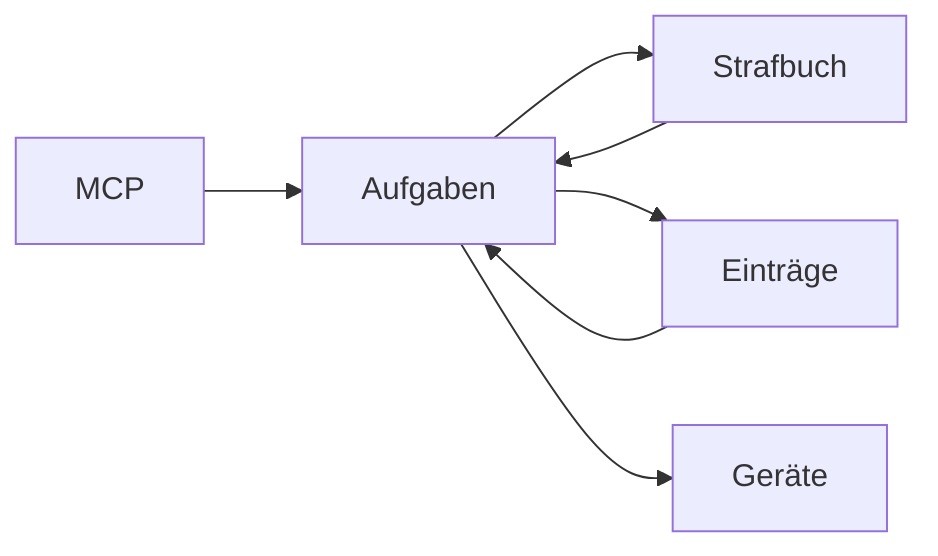

### Hängt ab von

| Woher | Wodurch | Was passiert | Anker |
|---|---|---|---|
| Einträge | `User.mobileDesktopUpload` | Erlaubt auf Mobilgeräten die Dateiauswahl statt nur die Kamera — schwächt jeden Foto-Nachweis, deshalb Admin-Feld. | — |
| MCP | `HealthHold.active` | Gesundheits-Halt: setzt die Direktiven aus. Die eine Bremse, die über allem steht. | — |
| Strafbuch | *feste Regel* | Eine Strafe kann eine gestellte Aufgabe sein. Wird das Urteil ersetzt oder zurückgenommen, zieht der Tracker die Aufgabe zurück; eine ERFÜLLTE Strafaufgabe schliesst das Urteil umgekehrt von selbst ab. | `strafurteilService.ts` |

### Wirkt auf

| Wohin | Wodurch | Was passiert | Anker |
|---|---|---|---|
| Strafbuch | `Task.holdUntil` | Festes Ende: bis dahin müssen alle Bedingungen durchgehend gelten. Im Dauer-Modus nur noch die obere Schranke. | `tasks.ts:effectiveHoldUntil` |
| Strafbuch | `Task.isPunishment` | Als Strafe gestellt. Rein kennzeichnend — die Verknüpfung zum Urteil steht in `StrafeRecord.taskId`. | — |
| Strafbuch | `Task.penaltyReason` | Begründung der Strafaufgabe. | — |
| Einträge | `TaskRequirement.type` | `KG_LOCKED` (verschlossen bleiben) oder `WEAR` (etwas tragen). Der KG ist bewusst keine Trage-Kategorie. | — |
| Geräte | `TaskRequirement.categoryId` | Geforderte Kategorie bei einer Trage-Bedingung. | — |
| Geräte | `TaskRequirement.deviceId` | Das konkrete Gerät; enger als die Kategorie und hat Vorrang. | — |
| Strafbuch | `TaskProof.dueOffsetMin` | Eigene Frist dieses Nachweises, in Minuten ab dem Nullpunkt der Aufgabe. Verstreicht sie unerfüllt, ist die Aufgabe SOFORT versäumt, nicht erst am Ende. | `tasks.ts:proofDeadline` |
| Einträge | *feste Regel* | Die Bedingungen einer Aufgabe werden bei jedem Lesen aus den Einträgen abgeleitet. Ein nachgetragener Eintrag korrigiert die Aufgabe von selbst; es gibt nichts zu bestätigen. | `tasks.ts` |
| Strafbuch | *feste Regel* | Eine nicht erfüllte Aufgabe ergibt GENAU EIN Vergehen — welcher der drei Vorwürfe gemeint ist, sagt erst die Ausfall-Art. | — |

## Trainingsziele

Steckbrief: [45-trainingsziele.md](45-trainingsziele.md)

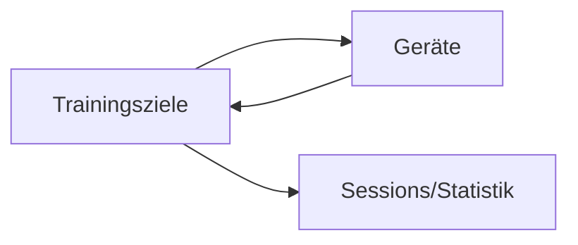

### Hängt ab von

| Woher | Wodurch | Was passiert | Anker |
|---|---|---|---|
| Geräte | `Device.categoryId` | Zuordnung zur Kategorie — entscheidet, welche Kategorie-Regeln (Tracking, Pflichtfoto, Trainingsziele) für dieses Gerät gelten. | `deviceCategoryService.ts:resolveOwnedCategory` |
| Geräte | `DeviceCategory.allowVorgaben` | Aus = die Kategorie lässt sich in keinem Trainingsziel verwenden — deshalb Keyholder-Feld: der Träger könnte sonst das Ziel aus der Hand nehmen. Bei der eingebauten Kategorie unveränderlich. | `deviceCategoryService.ts:resolveCategoryRuleChanges` |

### Wirkt auf

| Wohin | Wodurch | Was passiert | Anker |
|---|---|---|---|
| Geräte | `TrainingVorgabe.categoryId` | Für welche Kategorie das Ziel gilt. Kategorien mit `allowVorgaben: false` sind hier nicht wählbar. | — |
| Sessions/Statistik | `TrainingVorgabe.minProTagH` | Mindest-Tragestunden pro Tag. Gemessen wird Wanduhr-Zeit der Kategorie, nicht Gerätestunden. | `vorgaben.ts` |
| Sessions/Statistik | `TrainingVorgabe.minProWocheH` | Dasselbe je Woche. Die vier Perioden gelten nebeneinander, nicht alternativ. | — |
| Sessions/Statistik | `TrainingVorgabe.minProMonatH` | Dasselbe je Monat. | — |
| Sessions/Statistik | `TrainingVorgabe.minProJahrH` | Dasselbe je Jahr. | — |
| Sessions/Statistik | *feste Regel* | Ein Ziel MISST nur. Es fordert nichts ein, erzeugt keine Frist, keine Meldung und kein Vergehen — es liefert eine Zahl, die der Keyholder bewertet. | `vorgaben.ts` |

## Strafbuch

Steckbrief: [50-strafbuch.md](50-strafbuch.md)

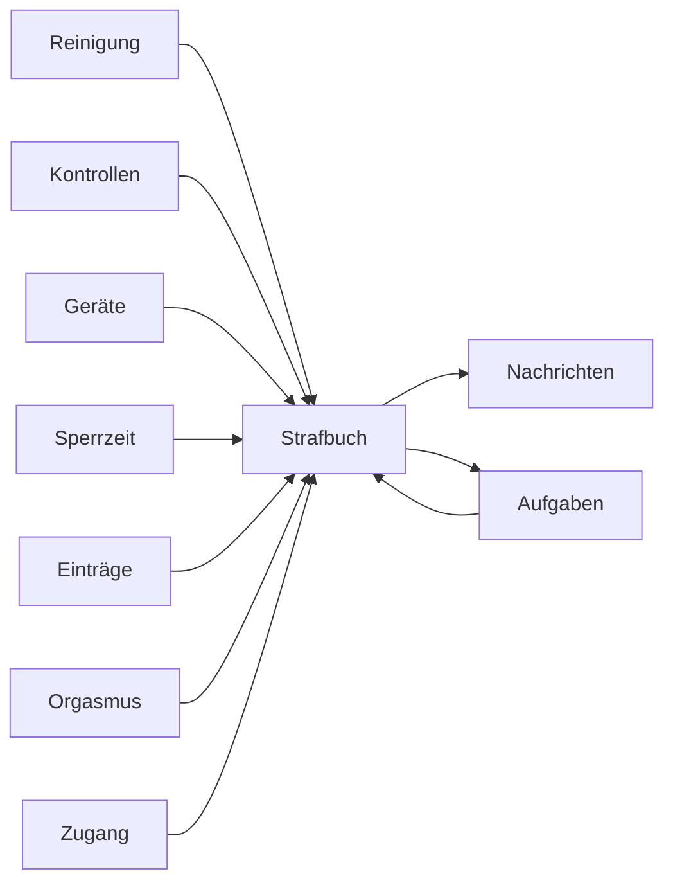

### Hängt ab von

| Woher | Wodurch | Was passiert | Anker |
|---|---|---|---|
| Reinigung | `User.reinigungErlaubt` | Ob Reinigungspausen überhaupt erlaubt sind. Notwendig, nicht hinreichend — eine aktive Sperrzeit muss es zusätzlich erlauben. | `queries.ts:cleaningBlockReason` |
| Reinigung | `User.reinigungMaxMinuten` | Höchstdauer EINER Pause. Darüber hinaus zählt die Pause als Tragezeit-Unterbrechung und wird zum erkannten Vergehen. | `cleaningRules.ts:reinigungRulesAt` |
| Reinigung | `User.reinigungMaxProTag` | ANZAHL Öffnungen pro Kalendertag des Subs (kein Minutenbudget). 0 = unbegrenzt. Wird nur erkannt, nie durchgesetzt. | `reinigungService.ts:maxPausesPerDaySentinel` |
| Kontrollen | `User.autoKontrolleAktiv` | Hauptschalter der Automatik. Aus schaltet BEIDES ab: den gewürfelten Tagesplan und die Kontrolle nach dem Wiederverschluss. | `autoKontrolleService.ts` |
| Kontrollen | `User.inspectionAutoMarkEnabled` | Stufe 2: bucht die unbeantwortete Kontrolle selbst als Öffnung bzw. Ablegen. Hebt dabei bewusst KEINE Sperrzeit auf. | `queries.ts:releaseSperrzeitenOnOpen` |
| Geräte | `Device.lookalikeClusterId` | Gleiche Optik = gleicher Cluster. Ein Bild-Konflikt INNERHALB eines Clusters ist nie ein Vergehen. | `mcp/devices.ts:set_device_meta` |
| Sperrzeit | `VerschlussAnforderung.endetAt` | Bei einer SPERRZEIT das Ende (leer = unbefristet), bei einer ANFORDERUNG die Frist zum Einschliessen. | `queries.ts:foldActiveSperrzeiten` |
| Sperrzeit | `VerschlussAnforderung.deviceId` | Verlangt ein bestimmtes Gerät. Nur hieraus entsteht das Vergehen „falsches Gerät“ — der Bild-Abgleich allein tut es nie. | — |
| Kontrollen | `KontrollAnforderung.deadline` | Erfüllungsfrist. Nach Ablauf verschwindet die Kontrolle nicht, sie wird überfällig — und ist der Startpunkt der Eskalation. | `inspectionEscalationService.ts` |
| Einträge | `Entry.oeffnenGrund` | Grund einer Öffnung. `REINIGUNG` ist der eine Wert, an dem die gesamte Reinigungsmechanik hängt — er entscheidet, ob die Sperrzeit fällt. | `queries.ts:isAllowedCleaningOpen` |
| Einträge | `Entry.startTime` | Der Zeitpunkt, den der Eintrag behauptet. Auf dem Sub-Pfad gegen Rückdatierung begrenzt, auf dem Keyholder-Pfad frei — dort erfüllt ein Nachtrag nur, was es zu seinem Zeitpunkt schon gab. | `entryFulfilment.ts` |
| Orgasmus | `OrgasmusAnforderung.art` | ANWEISUNG = Pflicht (ungenutzt ist ein Vergehen), GELEGENHEIT = Erlaubnis (ungenutzt folgenlos). Der ganze Unterschied der Direktive. | — |
| Orgasmus | `OrgasmusAnforderung.endetAt` | Ende des Fensters. Danach ist eine ANWEISUNG versäumt. | — |
| Orgasmus | `OrgasmusAnforderung.oeffnenErlaubt` | Erlaubt das Öffnen im Fenster, ohne dass es als unautorisiert zählt — der einzige Weg, eine Sperrzeit gezielt zu durchbrechen. | — |
| Aufgaben | `Task.holdUntil` | Festes Ende: bis dahin müssen alle Bedingungen durchgehend gelten. Im Dauer-Modus nur noch die obere Schranke. | `tasks.ts:effectiveHoldUntil` |
| Aufgaben | `Task.isPunishment` | Als Strafe gestellt. Rein kennzeichnend — die Verknüpfung zum Urteil steht in `StrafeRecord.taskId`. | — |
| Aufgaben | `Task.penaltyReason` | Begründung der Strafaufgabe. | — |
| Aufgaben | `TaskProof.dueOffsetMin` | Eigene Frist dieses Nachweises, in Minuten ab dem Nullpunkt der Aufgabe. Verstreicht sie unerfüllt, ist die Aufgabe SOFORT versäumt, nicht erst am Ende. | `tasks.ts:proofDeadline` |
| Kontrollen | *feste Regel* | Versäumt, abgelehnt oder automatisch als abgenommen gebucht — in jedem Fall ein erkanntes Vergehen, unabhängig davon, ob die Eskalation eingeschaltet ist. | — |
| Aufgaben | *feste Regel* | Eine nicht erfüllte Aufgabe ergibt GENAU EIN Vergehen — welcher der drei Vorwürfe gemeint ist, sagt erst die Ausfall-Art. | — |
| Zugang | *feste Regel* | Wird das Passwort eines ADMIN-Kontos geändert, während eine Sperrzeit läuft, entsteht ein Vergehen — als einziges im Moment des Vorgangs festgeschrieben statt live abgeleitet. | `passwordAudit.ts` |

### Wirkt auf

| Wohin | Wodurch | Was passiert | Anker |
|---|---|---|---|
| Nachrichten | `ManualOffense.title` | Worum es geht. Für alles, was der Tracker nicht sehen kann — gebrochene Abmachung, Unhöflichkeit. | — |
| Aufgaben | *feste Regel* | Eine Strafe kann eine gestellte Aufgabe sein. Wird das Urteil ersetzt oder zurückgenommen, zieht der Tracker die Aufgabe zurück; eine ERFÜLLTE Strafaufgabe schliesst das Urteil umgekehrt von selbst ab. | `strafurteilService.ts` |
| Nachrichten | *feste Regel* | Erkannte, bestrafte und verworfene Vergehen werden beiden Seiten gemeldet — abgeleitete aber erst ab dem Stichtag der Instanz, sonst kippte das erste Update die ganze Historie in den Posteingang. | `offenseAnnounce.ts` |

## Geräte

Steckbrief: [55-geraete.md](55-geraete.md)

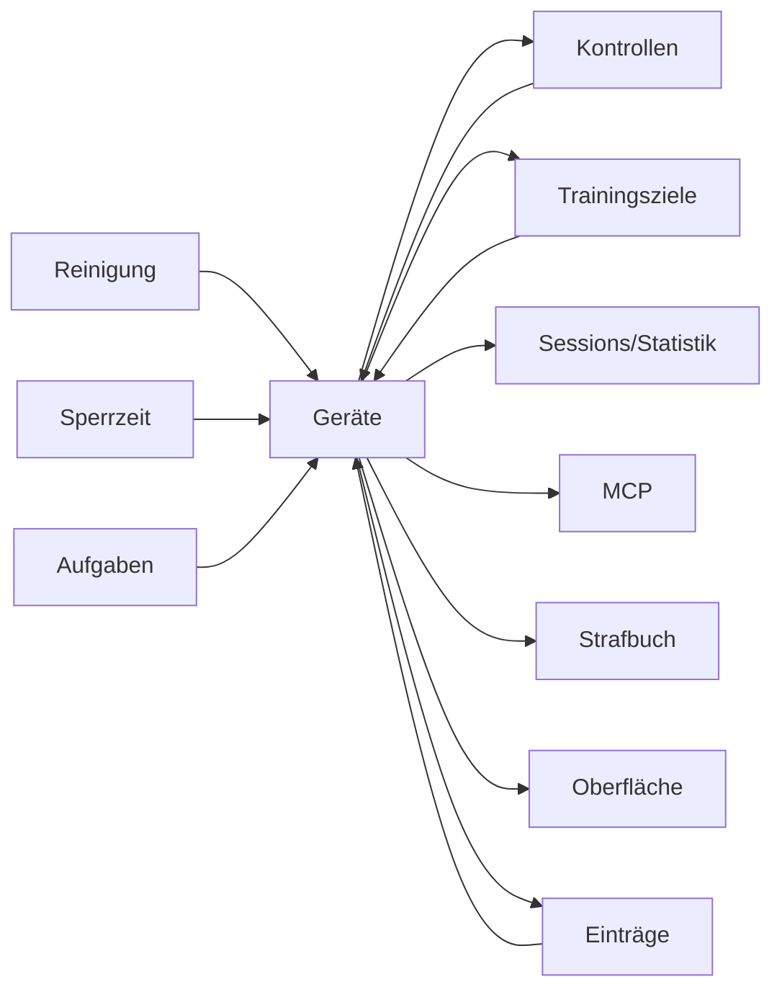

### Hängt ab von

| Woher | Wodurch | Was passiert | Anker |
|---|---|---|---|
| Reinigung | `User.reinigungErlaubt` | Ob Reinigungspausen überhaupt erlaubt sind. Notwendig, nicht hinreichend — eine aktive Sperrzeit muss es zusätzlich erlauben. | `queries.ts:cleaningBlockReason` |
| Sperrzeit | `VerschlussAnforderung.reinigungErlaubt` | Erlaubt DIESE Sperrzeit eine Reinigungsöffnung (und damit einen Gerätewechsel)? Es müssen ALLE gleichzeitig aktiven Sperrzeiten erlauben, nicht nur die neueste. | `queries.ts:foldActiveSperrzeiten` |
| Sperrzeit | `VerschlussAnforderung.deviceId` | Verlangt ein bestimmtes Gerät. Nur hieraus entsteht das Vergehen „falsches Gerät“ — der Bild-Abgleich allein tut es nie. | — |
| Kontrollen | `KontrollAnforderung.deviceId` | Verengt das Ziel auf genau ein Gerät und hat Vorrang vor der Kategorie. Es muss das getragene sein, sonst ist die Kontrolle nicht erfüllbar. | — |
| Einträge | `Entry.deviceId` | Welches Gerät der Eintrag betrifft. Bei einem Konflikt mit dem Bild gewinnt das Bild, nicht diese Deklaration. | — |
| Trainingsziele | `TrainingVorgabe.categoryId` | Für welche Kategorie das Ziel gilt. Kategorien mit `allowVorgaben: false` sind hier nicht wählbar. | — |
| Aufgaben | `TaskRequirement.categoryId` | Geforderte Kategorie bei einer Trage-Bedingung. | — |
| Aufgaben | `TaskRequirement.deviceId` | Das konkrete Gerät; enger als die Kategorie und hat Vorrang. | — |
| Reinigung | *feste Regel* | Es gibt keinen eigenen Gerätewechsel: er läuft über eine Reinigungsöffnung und verbraucht damit deren Tageskontingent. | — |

### Wirkt auf

| Wohin | Wodurch | Was passiert | Anker |
|---|---|---|---|
| Kontrollen | `Device.categoryId` | Zuordnung zur Kategorie — entscheidet, welche Kategorie-Regeln (Tracking, Pflichtfoto, Trainingsziele) für dieses Gerät gelten. | `deviceCategoryService.ts:resolveOwnedCategory` |
| Trainingsziele | `Device.categoryId` | Zuordnung zur Kategorie — entscheidet, welche Kategorie-Regeln (Tracking, Pflichtfoto, Trainingsziele) für dieses Gerät gelten. | `deviceCategoryService.ts:resolveOwnedCategory` |
| Sessions/Statistik | `Device.categoryId` | Zuordnung zur Kategorie — entscheidet, welche Kategorie-Regeln (Tracking, Pflichtfoto, Trainingsziele) für dieses Gerät gelten. | `deviceCategoryService.ts:resolveOwnedCategory` |
| MCP | `Device.securityLevel` | SECURING oder TRUST_ONLY — Einordnung für die Keyholder-Entscheidung. Wird nirgends durchgesetzt. | `mcp/devices.ts:set_device_meta` |
| Sessions/Statistik | `Device.lookalikeClusterId` | Gleiche Optik = gleicher Cluster. Ein Bild-Konflikt INNERHALB eines Clusters ist nie ein Vergehen. | `mcp/devices.ts:set_device_meta` |
| Strafbuch | `Device.lookalikeClusterId` | Gleiche Optik = gleicher Cluster. Ein Bild-Konflikt INNERHALB eines Clusters ist nie ein Vergehen. | `mcp/devices.ts:set_device_meta` |
| MCP | `Device.pullOffRisk` | Abstreifbar? `null` = nie beurteilt, nicht „sicher“. Reine Beurteilung ohne Durchsetzung. | `mcp/devices.ts:set_device_meta` |
| Oberfläche | `Device.name` | Anzeigename. Geht zusätzlich in die Geräte-Erkennung ein, zusammen mit den Bildern und den drei optischen Feldern. | — |
| Sessions/Statistik | `Device.archivedAt` | Soft-Delete: gesetzt = archiviert, aus Auswahllisten raus, Historie bleibt. | — |
| Oberfläche | `Device.description` | Freitext — und eines der drei optischen Felder, die in die Geräte-Erkennung eingehen. Prosa über das Tragegefühl verwässert sie hier; die gehört in die Sitz-Notizen. | `deviceReferenceService.ts:visualTraitsOf` |
| Sessions/Statistik | `DeviceCategory.trackingEnabled` | Aus = reine Inventar-Kategorie: keine Trage-Sessions, keine Statistik. Abwesenheit in den Auswertungen ist dann keine Nichtnutzung. Bei der eingebauten Kategorie unveränderlich. | `deviceCategoryService.ts:resolveCategoryRuleChanges` |
| Einträge | `DeviceCategory.trackingEnabled` | Aus = reine Inventar-Kategorie: keine Trage-Sessions, keine Statistik. Abwesenheit in den Auswertungen ist dann keine Nichtnutzung. Bei der eingebauten Kategorie unveränderlich. | `deviceCategoryService.ts:resolveCategoryRuleChanges` |
| Einträge | `DeviceCategory.requirePhoto` | Ein Trage-Beginn dieser Kategorie verlangt ein Bild. Bei der eingebauten Kategorie unveränderlich. | `deviceCategoryService.ts:resolveCategoryRuleChanges` |
| Trainingsziele | `DeviceCategory.allowVorgaben` | Aus = die Kategorie lässt sich in keinem Trainingsziel verwenden — deshalb Keyholder-Feld: der Träger könnte sonst das Ziel aus der Hand nehmen. Bei der eingebauten Kategorie unveränderlich. | `deviceCategoryService.ts:resolveCategoryRuleChanges` |
| Oberfläche | `DeviceCategory.name` | Anzeigename der Kategorie; frei änderbar, der `slug` bleibt. | — |
| Oberfläche | `DeviceCategory.sortOrder` | Reihenfolge in Listen und Auswahlfeldern. | — |
| Oberfläche | `DeviceCategory.color` | Farbmarke der Kategorie (CSS-Variablen-Suffix). | — |
| Oberfläche | `DeviceCategory.icon` | Symbol der Kategorie (lucide-Name). | — |
| Einträge | *feste Regel* | Das massgebliche Gerät eines Segments ist das EFFEKTIVE: bei einem Konflikt zwischen Bild und Deklaration gewinnt das Bild — ausser innerhalb eines Lookalike-Clusters. | `sessionModel.ts:effectiveDevice` |

## Box

Steckbrief: [60-box.md](60-box.md)

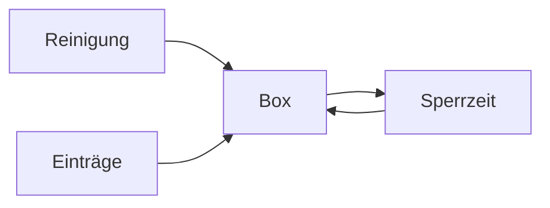

### Hängt ab von

| Woher | Wodurch | Was passiert | Anker |
|---|---|---|---|
| Reinigung | `User.reinigungErlaubt` | Ob Reinigungspausen überhaupt erlaubt sind. Notwendig, nicht hinreichend — eine aktive Sperrzeit muss es zusätzlich erlauben. | `queries.ts:cleaningBlockReason` |
| Reinigung | `User.reinigungsFenster` | Tages-Zeitfenster (JSON-Liste). Binden NUR während einer Sperrzeit, die die Reinigung erlaubt. Leere Liste = nicht zeitgebunden, kein Verbot. | `queries.ts:cleaningWindowBindingStatus` |
| Sperrzeit | `VerschlussAnforderung.reinigungErlaubt` | Erlaubt DIESE Sperrzeit eine Reinigungsöffnung (und damit einen Gerätewechsel)? Es müssen ALLE gleichzeitig aktiven Sperrzeiten erlauben, nicht nur die neueste. | `queries.ts:foldActiveSperrzeiten` |
| Sperrzeit | `VerschlussAnforderung.endetAt` | Bei einer SPERRZEIT das Ende (leer = unbefristet), bei einer ANFORDERUNG die Frist zum Einschliessen. | `queries.ts:foldActiveSperrzeiten` |
| Einträge | `Entry.keyInBox` | Erklärung beim Verschluss, ob der Schlüssel in die Box wandert. `false` = er behält ihn, die Box bekommt bewusst KEIN Sperr-Kommando. `null` = nicht gefragt. | `boxCommand.ts` |
| Einträge | *feste Regel* | Die Box folgt den Einträgen: aus Verschluss und Öffnen leitet der Tracker ihr Kommando ab. Eine VERBOTENE Öffnung bekommt keines — sonst vollzöge er das Vergehen, das er dokumentiert. | `boxCommand.ts` |
| Sperrzeit | *feste Regel* | Läuft eine Sperrzeit, hält die Box den Schlüssel fest. Die Sperre ist damit mehr als ein Datenbank-Eintrag. | `boxCommand.ts` |

### Wirkt auf

| Wohin | Wodurch | Was passiert | Anker |
|---|---|---|---|
| Sperrzeit | *feste Regel* | Die Failsafes (leerer Akku, zu lange offline, absolutes Hard-Cap) öffnen physisch auch gegen eine laufende Sperrzeit und gegen den Keyholder. Der Tracker-Zustand ändert sich dabei NICHT — beide laufen dann auseinander. | `boxOpenOutlook.ts` |

## Nachrichten

Steckbrief: [70-nachrichten.md](70-nachrichten.md)

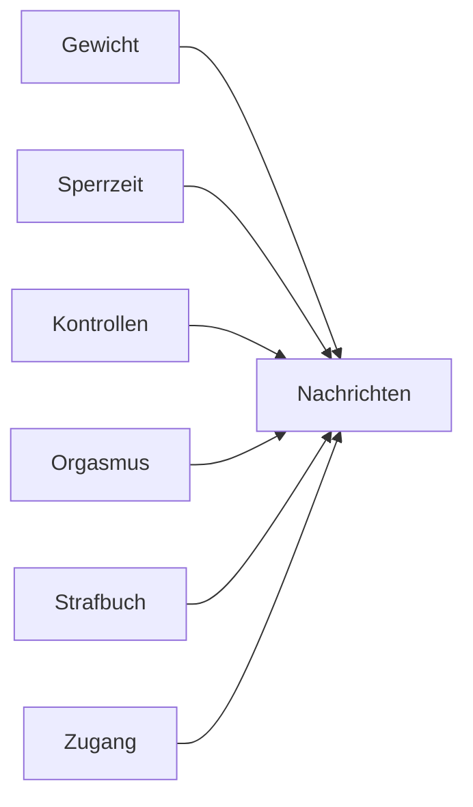

### Hängt ab von

| Woher | Wodurch | Was passiert | Anker |
|---|---|---|---|
| Gewicht | `User.targetMinKg` | Untergrenze des Zielkorridors, gesetzt vom Träger. Eine Unterschreitung meldet der Keyholderin — sie entscheidet, ob etwas folgt. | `weight.ts:effectiveCorridor` |
| Gewicht | `User.targetMaxKg` | Obergrenze des Zielkorridors, gesetzt vom Träger. | `weight.ts:effectiveCorridor` |
| Sperrzeit | `VerschlussAnforderung.nachricht` | Begleittext an den Sub; erscheint in der Meldung und im Posteingang. | — |
| Kontrollen | `KontrollAnforderung.kommentar` | Begleittext an den Sub. | — |
| Orgasmus | `OrgasmusAnforderung.nachricht` | Begleittext an den Sub. | — |
| Strafbuch | `ManualOffense.title` | Worum es geht. Für alles, was der Tracker nicht sehen kann — gebrochene Abmachung, Unhöflichkeit. | — |
| Zugang | `AdminUserRelationship.adminId` | Wer diesen Sub steuern darf. Ohne Zeile sieht ein Admin ihn nicht — die Zuordnung ist die eigentliche Berechtigung. | — |
| Strafbuch | *feste Regel* | Erkannte, bestrafte und verworfene Vergehen werden beiden Seiten gemeldet — abgeleitete aber erst ab dem Stichtag der Instanz, sonst kippte das erste Update die ganze Historie in den Posteingang. | `offenseAnnounce.ts` |

### Wirkt auf

Nichts hängt daran — was hier passiert, bleibt hier.

## Benachrichtigungen

Steckbrief: [75-benachrichtigungen.md](75-benachrichtigungen.md)

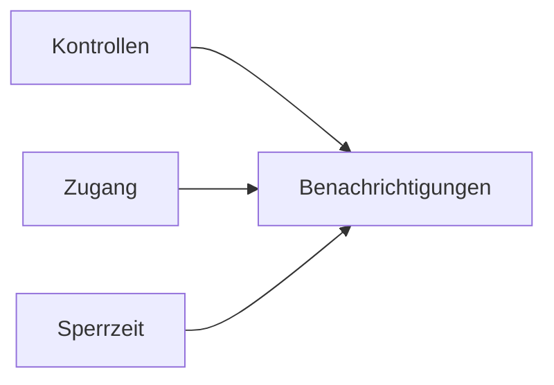

### Hängt ab von

| Woher | Wodurch | Was passiert | Anker |
|---|---|---|---|
| Kontrollen | `User.inspectionReminderEnabled` | Stufe 1: mahnt eine überfällige Kontrolle an. Setzt nur den Uhr-Anker für Stufe 2 — ohne sie beginnt Stufe 2 nie. | `inspectionEscalationService.ts` |
| Kontrollen | `User.inspectionReminderDelayMinutes` | Verzug bis zur Mahnung, gemessen ab dem Ablauf der Kontroll-Frist. | `inspectionEscalationService.ts` |
| Zugang | `User.locale` | Sprache der Oberfläche UND aller Anschreiben — auch der Portal-Mails, die sie von hier lesen. | `emailI18n.ts` |
| Sperrzeit | `VerschlussAnforderung.wirksamAb` | Terminierte Auslösung. Bis dahin existiert die Direktive für den Sub nicht: keine Anzeige, keine Meldung, keine laufende Frist. | — |

### Wirkt auf

Nichts hängt daran — was hier passiert, bleibt hier.

## MCP

Steckbrief: [80-kontext.md](80-kontext.md)

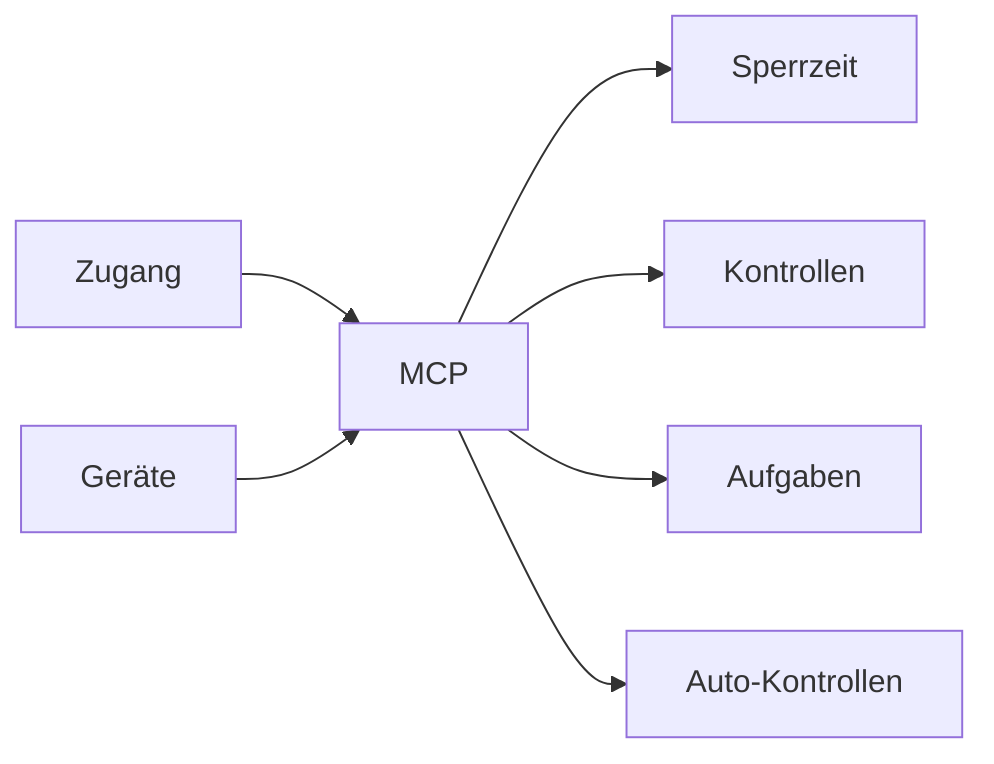

### Hängt ab von

| Woher | Wodurch | Was passiert | Anker |
|---|---|---|---|
| Zugang | `User.role` | `user` oder `admin`. Entscheidet über Admin-Oberfläche, MCP-Zugang und das Handeln für fremde Konten. | `authGuards.ts:requireAdminApi` |
| Geräte | `Device.securityLevel` | SECURING oder TRUST_ONLY — Einordnung für die Keyholder-Entscheidung. Wird nirgends durchgesetzt. | `mcp/devices.ts:set_device_meta` |
| Geräte | `Device.pullOffRisk` | Abstreifbar? `null` = nie beurteilt, nicht „sicher“. Reine Beurteilung ohne Durchsetzung. | `mcp/devices.ts:set_device_meta` |
| Zugang | `AdminUserRelationship.adminId` | Wer diesen Sub steuern darf. Ohne Zeile sieht ein Admin ihn nicht — die Zuordnung ist die eigentliche Berechtigung. | — |

### Wirkt auf

| Wohin | Wodurch | Was passiert | Anker |
|---|---|---|---|
| Sperrzeit | `HealthHold.active` | Gesundheits-Halt: setzt die Direktiven aus. Die eine Bremse, die über allem steht. | — |
| Kontrollen | `HealthHold.active` | Gesundheits-Halt: setzt die Direktiven aus. Die eine Bremse, die über allem steht. | — |
| Aufgaben | `HealthHold.active` | Gesundheits-Halt: setzt die Direktiven aus. Die eine Bremse, die über allem steht. | — |
| Auto-Kontrollen | `HealthHold.active` | Gesundheits-Halt: setzt die Direktiven aus. Die eine Bremse, die über allem steht. | — |
| Sperrzeit | `RecurringContext.deviceFree` | Der Slot verlangt Gerätefreiheit — die Information, wegen der der Keyholder ihn überhaupt führt. | — |
| Sperrzeit | `Appointment.deviceFree` | Der Termin verlangt Gerätefreiheit. | — |

## Zugang

Steckbrief: [85-zugang.md](85-zugang.md)

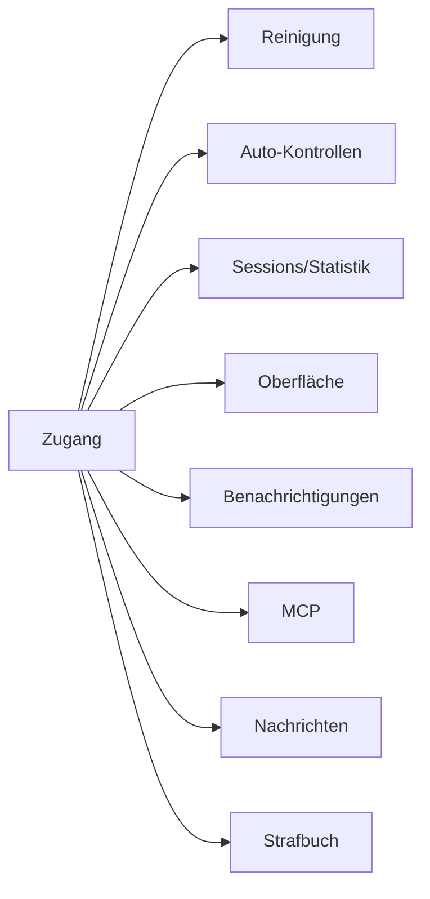

### Hängt ab von

Nichts wirkt hier hinein — diese Mechanik lässt sich für sich allein betrachten.

### Wirkt auf

| Wohin | Wodurch | Was passiert | Anker |
|---|---|---|---|
| Reinigung | `User.timezone` | Die Wanduhr des Subs. Kalendertag, Reinigungsfenster und Schlaf-Fenster rechnen darin — nicht in der Serverzone. Historisiert: eine Umstellung wirkt ab jetzt, vergangene Öffnungen bleiben nach der damaligen Zone beurteilt. | `timezoneRules.ts:timezoneRulesFrom` |
| Auto-Kontrollen | `User.timezone` | Die Wanduhr des Subs. Kalendertag, Reinigungsfenster und Schlaf-Fenster rechnen darin — nicht in der Serverzone. Historisiert: eine Umstellung wirkt ab jetzt, vergangene Öffnungen bleiben nach der damaligen Zone beurteilt. | `timezoneRules.ts:timezoneRulesFrom` |
| Sessions/Statistik | `User.timezone` | Die Wanduhr des Subs. Kalendertag, Reinigungsfenster und Schlaf-Fenster rechnen darin — nicht in der Serverzone. Historisiert: eine Umstellung wirkt ab jetzt, vergangene Öffnungen bleiben nach der damaligen Zone beurteilt. | `timezoneRules.ts:timezoneRulesFrom` |
| Oberfläche | `User.startPage` | Startseite nach der Anmeldung; `auto` wählt sie nach Rolle. | `userSelfField.ts` |
| Oberfläche | `User.dashboardLayout` | Abweichungen vom Standard-Dashboard (ausgeblendete Blöcke, eigene Reihenfolge) als JSON je Oberfläche. Leer = Standard. | `dashboardLayout.ts:resolveLayout` |
| Oberfläche | `User.hideOwnTracker` | Blendet den eigenen Tracker in der Keyholder-Ansicht aus — für Admin-Konten, die selbst keinen führen. | `ownTracker.ts` |
| Oberfläche | `User.locale` | Sprache der Oberfläche UND aller Anschreiben — auch der Portal-Mails, die sie von hier lesen. | `emailI18n.ts` |
| Benachrichtigungen | `User.locale` | Sprache der Oberfläche UND aller Anschreiben — auch der Portal-Mails, die sie von hier lesen. | `emailI18n.ts` |
| MCP | `User.role` | `user` oder `admin`. Entscheidet über Admin-Oberfläche, MCP-Zugang und das Handeln für fremde Konten. | `authGuards.ts:requireAdminApi` |
| MCP | `AdminUserRelationship.adminId` | Wer diesen Sub steuern darf. Ohne Zeile sieht ein Admin ihn nicht — die Zuordnung ist die eigentliche Berechtigung. | — |
| Nachrichten | `AdminUserRelationship.adminId` | Wer diesen Sub steuern darf. Ohne Zeile sieht ein Admin ihn nicht — die Zuordnung ist die eigentliche Berechtigung. | — |
| Strafbuch | *feste Regel* | Wird das Passwort eines ADMIN-Kontos geändert, während eine Sperrzeit läuft, entsteht ein Vergehen — als einziges im Moment des Vorgangs festgeschrieben statt live abgeleitet. | `passwordAudit.ts` |

## Gewicht

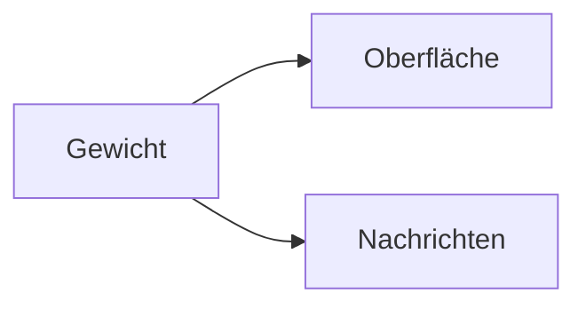

### Hängt ab von

Nichts wirkt hier hinein — diese Mechanik lässt sich für sich allein betrachten.

### Wirkt auf

| Wohin | Wodurch | Was passiert | Anker |
|---|---|---|---|
| Oberfläche | `User.weightTrackingEnabled` | Schaltet das Gewichtstracking für diesen Träger frei. Aus = Erfassung, Anzeigen und MCP-Schreiben verschwinden; die Daten bleiben. Zusätzlich muss die Instanz das Feature führen (`ENABLE_WEIGHT_TRACKING`). | `authGuards.ts:weightTrackingGate` |
| Oberfläche | `User.referenceSex` | Wählt die Referenztabelle für den Normbereich beim Setzen der Grenzen. Der BMI selbst rechnet ohne sie. | `weight.ts:normalWeightRangeKg` |
| Oberfläche | `User.unitSystem` | Anzeige-Einheit DESSEN, DER SCHAUT (metrisch/imperial). Gespeichert wird immer metrisch — eine Keyholderin darf Pfund sehen, während ihr Träger in Kilogramm einträgt. | `weight.ts:weightForDisplay` |
| Nachrichten | `User.targetMinKg` | Untergrenze des Zielkorridors, gesetzt vom Träger. Eine Unterschreitung meldet der Keyholderin — sie entscheidet, ob etwas folgt. | `weight.ts:effectiveCorridor` |
| Nachrichten | `User.targetMaxKg` | Obergrenze des Zielkorridors, gesetzt vom Träger. | `weight.ts:effectiveCorridor` |

## Auto-Kontrollen

Steckbrief: [30-kontrollen.md](30-kontrollen.md)

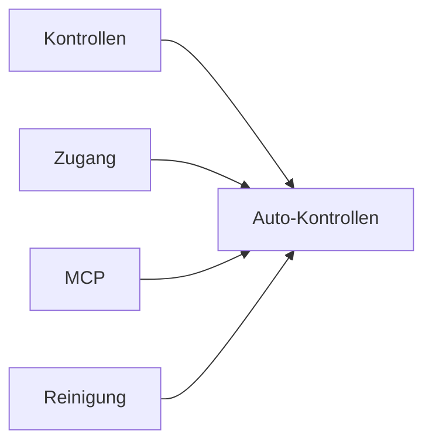

### Hängt ab von

| Woher | Wodurch | Was passiert | Anker |
|---|---|---|---|
| Kontrollen | `User.autoKontrolleAktiv` | Hauptschalter der Automatik. Aus schaltet BEIDES ab: den gewürfelten Tagesplan und die Kontrolle nach dem Wiederverschluss. | `autoKontrolleService.ts` |
| Kontrollen | `User.autoKontrollePerDayMin` | Untergrenze der pro Tag gewürfelten Anzahl. Zusammen mit Max auf 0 bleibt nur die Kontrolle nach dem Wiederverschluss. | `autoKontrolleService.ts:generateAutoKontrollen` |
| Kontrollen | `User.autoKontrollePerDayMax` | Obergrenze derselben Auslosung. Unter Min gesetzt wird er auf Min angehoben statt abgelehnt. | `autoKontrolleService.ts:clampPerDay` |
| Kontrollen | `User.autoKontrolleRuheVon` | Beginn des Schlaf-Fensters (Wanduhr des Subs). Darin wird weder ausgelöst noch eine Frist platziert. | `autoKontrolleService.ts:isInQuietMinutes` |
| Kontrollen | `User.autoKontrolleRuheBis` | Ende des Schlaf-Fensters. Das Komplement daraus ist das Wach-Fenster, über das der Tagesplan verteilt wird. | `autoKontrolleService.ts:awakeWindow` |
| Kontrollen | `User.autoKontrolleFristVon` | Untergrenze der Erfüllungsfrist je Kontrolle (Minuten). Bleibt sie vor dem Schlaf-Beginn nicht mehr ganz übrig, entfällt der Slot. | `autoKontrolleService.ts:windowDeadline` |
| Kontrollen | `User.autoKontrolleFristBis` | Obergrenze derselben Frist; je Kontrolle wird zufällig aus der Spanne gezogen. | `autoKontrolleService.ts:clampFrist` |
| Kontrollen | `User.autoKontrolleFensterVon` | Beginn eines optionalen festen Auslöse-Fensters. Leer = ganzes Wach-Fenster. Wrappt bewusst nicht über Mitternacht. | `autoKontrolleService.ts:fixedWindowMinutes` |
| Kontrollen | `User.autoKontrolleFensterBis` | Ende desselben Fensters. Liegt es vollständig im Schlaf-Fenster, wird die Kombination abgelehnt statt wirkungslos gespeichert. | `autoKontrolleService.ts:triggerWindowAllQuiet` |
| Kontrollen | `User.autoKontrolleNurBeiSperre` | Stellt den Tagesplan nur während einer laufenden Sperrzeit zu. Gilt NICHT für die Kontrolle nach dem Wiederverschluss. | `autoKontrolleService.ts` |
| Zugang | `User.timezone` | Die Wanduhr des Subs. Kalendertag, Reinigungsfenster und Schlaf-Fenster rechnen darin — nicht in der Serverzone. Historisiert: eine Umstellung wirkt ab jetzt, vergangene Öffnungen bleiben nach der damaligen Zone beurteilt. | `timezoneRules.ts:timezoneRulesFrom` |
| Kontrollen | `KontrollAnforderung.wirksamAb` | Terminierte Zustellung; bis dahin für den Sub unsichtbar und ohne laufende Frist. Auch der Weg, auf dem der Tagesplan vorab angelegt wird. | — |
| MCP | `HealthHold.active` | Gesundheits-Halt: setzt die Direktiven aus. Die eine Bremse, die über allem steht. | — |
| Reinigung | *feste Regel* | Jeder SELBST erfasste Wiederverschluss nach einer Reinigungspause erzeugt eine Kontrolle (15–45 min, im Schlaf-Fenster 5–15). Sie ersetzt die nächste noch nicht zugestellte Auto-Kontrolle des Tages. Feste Regel, keine Einstellung — nur der Hauptschalter der Automatik schaltet sie ab. | `autoKontrolleService.ts:scheduleCleaningRelockInspection` |

### Wirkt auf

Nichts hängt daran — was hier passiert, bleibt hier.

## Oberfläche

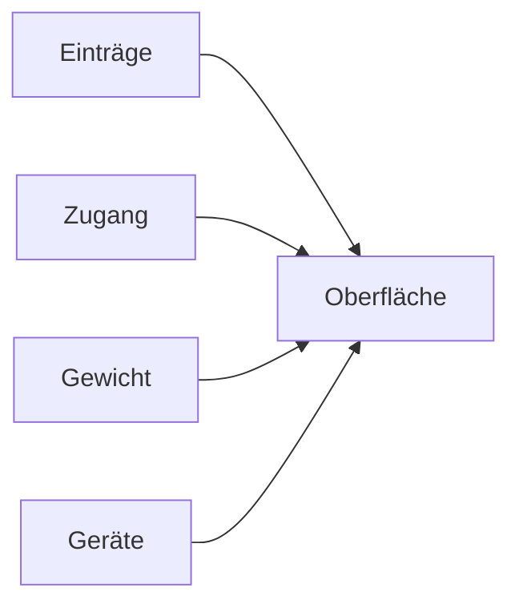

### Hängt ab von

| Woher | Wodurch | Was passiert | Anker |
|---|---|---|---|
| Einträge | `User.mobileDesktopUpload` | Erlaubt auf Mobilgeräten die Dateiauswahl statt nur die Kamera — schwächt jeden Foto-Nachweis, deshalb Admin-Feld. | — |
| Zugang | `User.startPage` | Startseite nach der Anmeldung; `auto` wählt sie nach Rolle. | `userSelfField.ts` |
| Zugang | `User.dashboardLayout` | Abweichungen vom Standard-Dashboard (ausgeblendete Blöcke, eigene Reihenfolge) als JSON je Oberfläche. Leer = Standard. | `dashboardLayout.ts:resolveLayout` |
| Zugang | `User.hideOwnTracker` | Blendet den eigenen Tracker in der Keyholder-Ansicht aus — für Admin-Konten, die selbst keinen führen. | `ownTracker.ts` |
| Zugang | `User.locale` | Sprache der Oberfläche UND aller Anschreiben — auch der Portal-Mails, die sie von hier lesen. | `emailI18n.ts` |
| Gewicht | `User.weightTrackingEnabled` | Schaltet das Gewichtstracking für diesen Träger frei. Aus = Erfassung, Anzeigen und MCP-Schreiben verschwinden; die Daten bleiben. Zusätzlich muss die Instanz das Feature führen (`ENABLE_WEIGHT_TRACKING`). | `authGuards.ts:weightTrackingGate` |
| Gewicht | `User.referenceSex` | Wählt die Referenztabelle für den Normbereich beim Setzen der Grenzen. Der BMI selbst rechnet ohne sie. | `weight.ts:normalWeightRangeKg` |
| Gewicht | `User.unitSystem` | Anzeige-Einheit DESSEN, DER SCHAUT (metrisch/imperial). Gespeichert wird immer metrisch — eine Keyholderin darf Pfund sehen, während ihr Träger in Kilogramm einträgt. | `weight.ts:weightForDisplay` |
| Geräte | `Device.name` | Anzeigename. Geht zusätzlich in die Geräte-Erkennung ein, zusammen mit den Bildern und den drei optischen Feldern. | — |
| Geräte | `Device.description` | Freitext — und eines der drei optischen Felder, die in die Geräte-Erkennung eingehen. Prosa über das Tragegefühl verwässert sie hier; die gehört in die Sitz-Notizen. | `deviceReferenceService.ts:visualTraitsOf` |
| Geräte | `DeviceCategory.name` | Anzeigename der Kategorie; frei änderbar, der `slug` bleibt. | — |
| Geräte | `DeviceCategory.sortOrder` | Reihenfolge in Listen und Auswahlfeldern. | — |
| Geräte | `DeviceCategory.color` | Farbmarke der Kategorie (CSS-Variablen-Suffix). | — |
| Geräte | `DeviceCategory.icon` | Symbol der Kategorie (lucide-Name). | — |

### Wirkt auf

Nichts hängt daran — was hier passiert, bleibt hier.

## Sessions/Statistik

Steckbrief: [15-eintraege.md](15-eintraege.md)

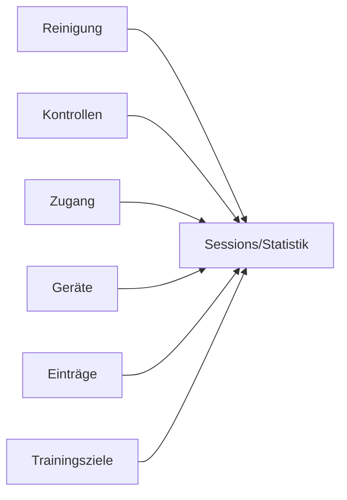

### Hängt ab von

| Woher | Wodurch | Was passiert | Anker |
|---|---|---|---|
| Reinigung | `User.reinigungMaxMinuten` | Höchstdauer EINER Pause. Darüber hinaus zählt die Pause als Tragezeit-Unterbrechung und wird zum erkannten Vergehen. | `cleaningRules.ts:reinigungRulesAt` |
| Kontrollen | `User.inspectionAutoMarkEnabled` | Stufe 2: bucht die unbeantwortete Kontrolle selbst als Öffnung bzw. Ablegen. Hebt dabei bewusst KEINE Sperrzeit auf. | `queries.ts:releaseSperrzeitenOnOpen` |
| Zugang | `User.timezone` | Die Wanduhr des Subs. Kalendertag, Reinigungsfenster und Schlaf-Fenster rechnen darin — nicht in der Serverzone. Historisiert: eine Umstellung wirkt ab jetzt, vergangene Öffnungen bleiben nach der damaligen Zone beurteilt. | `timezoneRules.ts:timezoneRulesFrom` |
| Geräte | `Device.categoryId` | Zuordnung zur Kategorie — entscheidet, welche Kategorie-Regeln (Tracking, Pflichtfoto, Trainingsziele) für dieses Gerät gelten. | `deviceCategoryService.ts:resolveOwnedCategory` |
| Geräte | `Device.lookalikeClusterId` | Gleiche Optik = gleicher Cluster. Ein Bild-Konflikt INNERHALB eines Clusters ist nie ein Vergehen. | `mcp/devices.ts:set_device_meta` |
| Geräte | `Device.archivedAt` | Soft-Delete: gesetzt = archiviert, aus Auswahllisten raus, Historie bleibt. | — |
| Geräte | `DeviceCategory.trackingEnabled` | Aus = reine Inventar-Kategorie: keine Trage-Sessions, keine Statistik. Abwesenheit in den Auswertungen ist dann keine Nichtnutzung. Bei der eingebauten Kategorie unveränderlich. | `deviceCategoryService.ts:resolveCategoryRuleChanges` |
| Einträge | `Entry.oeffnenGrund` | Grund einer Öffnung. `REINIGUNG` ist der eine Wert, an dem die gesamte Reinigungsmechanik hängt — er entscheidet, ob die Sperrzeit fällt. | `queries.ts:isAllowedCleaningOpen` |
| Einträge | `Entry.deviceId` | Welches Gerät der Eintrag betrifft. Bei einem Konflikt mit dem Bild gewinnt das Bild, nicht diese Deklaration. | — |
| Einträge | `Entry.startTime` | Der Zeitpunkt, den der Eintrag behauptet. Auf dem Sub-Pfad gegen Rückdatierung begrenzt, auf dem Keyholder-Pfad frei — dort erfüllt ein Nachtrag nur, was es zu seinem Zeitpunkt schon gab. | `entryFulfilment.ts` |
| Trainingsziele | `TrainingVorgabe.minProTagH` | Mindest-Tragestunden pro Tag. Gemessen wird Wanduhr-Zeit der Kategorie, nicht Gerätestunden. | `vorgaben.ts` |
| Trainingsziele | `TrainingVorgabe.minProWocheH` | Dasselbe je Woche. Die vier Perioden gelten nebeneinander, nicht alternativ. | — |
| Trainingsziele | `TrainingVorgabe.minProMonatH` | Dasselbe je Monat. | — |
| Trainingsziele | `TrainingVorgabe.minProJahrH` | Dasselbe je Jahr. | — |
| Reinigung | *feste Regel* | Eine Pause zerlegt die KG-Session in Segmente und wird von der Tragedauer abgezogen — die Session bricht dabei nicht. | `sessionModel.ts:buildSessions` |
| Einträge | *feste Regel* | Sessions, Segmente und jede Stundenzahl entstehen beim LESEN aus den Einträgen. Nichts davon ist gestempelt — ein korrigierter Eintrag korrigiert alles Nachgelagerte mit. | `sessionModel.ts:buildSessions` |
| Trainingsziele | *feste Regel* | Ein Ziel MISST nur. Es fordert nichts ein, erzeugt keine Frist, keine Meldung und kein Vergehen — es liefert eine Zahl, die der Keyholder bewertet. | `vorgaben.ts` |

### Wirkt auf

Nichts hängt daran — was hier passiert, bleibt hier.
