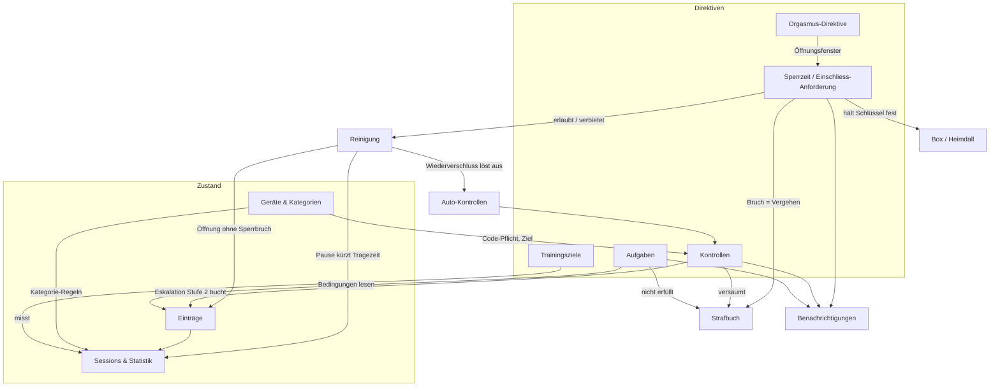

# Funktionsmodell

Was der Tracker kann, was sich einstellen lässt und — vor allem — **was worauf wirkt**.

Diese Sammlung beantwortet nicht „welche Features gibt es". Das liesse sich aus der Oberfläche
ablesen. Sie beantwortet die Frage, die im Betrieb tatsächlich stellt: *warum hat sich das System
gerade so verhalten, obwohl der Schalter doch anders steht.* Solche Fälle entstehen fast nie aus
einem Fehler in einer Mechanik, sondern aus dem Zusammenspiel zweier Mechaniken, die je für sich
richtig arbeiten.

Adressat sind Betreiber und Entwickler. Für die Keyholder-KI gibt es die eigene, bewusst anders
geschnittene Referenz `src/lib/mcpModelDoc.ts` (Tool `explain_model`); für den Sub die Regel-Seite
in der App. Wo sich Aussagen überschneiden, ist diese Sammlung die technische, jene die
handlungsleitende Fassung.

## Aufbau

| Datei | Inhalt |
|---|---|
| [stellschrauben.md](stellschrauben.md) | **Generiert.** Jedes Feld, das Verhalten steuert: Typ, Default, wer schreiben darf, worauf es wirkt, wo die Regel im Code steht. |
| [05-abhaengigkeiten.md](05-abhaengigkeiten.md) | **Generiert.** Je Funktion: was in sie hineinwirkt und worauf sie selbst wirkt — mit Diagramm. Die Gegenrichtung zum Register. |
| [90-kollisionen.md](90-kollisionen.md) | **Vorrang- und Kollisionsregeln.** Was gewinnt, wenn zwei Regeln gleichzeitig gelten. |
| [10-sperrzeit.md](10-sperrzeit.md) | Sperrzeit und Einschliess-Anforderung |
| [15-eintraege.md](15-eintraege.md) | Einträge & Sessions — der Rohstoff, aus dem alles abgeleitet wird |
| [20-reinigung.md](20-reinigung.md) | Reinigung (und damit der Gerätewechsel) |
| [30-kontrollen.md](30-kontrollen.md) | Kontrollen: manuell, automatisch, Eskalation |
| [35-orgasmus.md](35-orgasmus.md) | Orgasmus-Direktive |
| [40-aufgaben.md](40-aufgaben.md) | Aufgaben: Bedingungen, Nachweise, Sichtung |
| [45-trainingsziele.md](45-trainingsziele.md) | Trainingsziele |
| [50-strafbuch.md](50-strafbuch.md) | Vergehen & Strafbuch |
| [55-geraete.md](55-geraete.md) | Geräte & Kategorien |
| [60-box.md](60-box.md) | Box (Heimdall) |
| [70-nachrichten.md](70-nachrichten.md) | Nachrichten / Posteingang |
| [75-benachrichtigungen.md](75-benachrichtigungen.md) | Benachrichtigungen (Mail, Push) |
| [80-kontext.md](80-kontext.md) | Keyholder-Wissen & Kontext (die MCP-Gedächtnisschicht) |
| [85-zugang.md](85-zugang.md) | Konto, Zugang & Darstellung |

Die Steckbriefe folgen alle demselben Raster (Zweck, Stellschrauben, Auslöser, Wirkt auf,
Unterdrückt von, Sichtbarkeit, Code, Tests). Das ist Absicht: eine Frage lässt sich so in jedem
Steckbrief an derselben Stelle beantworten, und eine leere Rubrik ist ein Befund, kein Formfehler.

## Wo anfangen

- **„Was kann ich einstellen?"** → [stellschrauben.md](stellschrauben.md), nach Domäne sortiert.
- **„Was hängt an dieser Funktion?"** → [05-abhaengigkeiten.md](05-abhaengigkeiten.md). Je Mechanik
  beide Richtungen, und getrennt danach, ob hinter einer Kante ein Schalter steht oder nicht.
- **„Warum ist das passiert?"** → [90-kollisionen.md](90-kollisionen.md). Dort stehen die Fälle, in
  denen zwei richtige Regeln ein überraschendes Ergebnis produzieren.
- **„Wie funktioniert X?"** → der Steckbrief der Mechanik.

## Systemkarte

Die Mechaniken und ihre Kanten. Eine Kante heisst „liest" oder „löst aus", nicht „ruft auf" — es ist
eine Wirkungskarte, kein Abhängigkeitsgraph des Codes.



Jede Mechanik der Karte hat einen Steckbrief. Was fehlt, ist keine Mechanik, sondern Tiefe: die
Kollisionsliste wächst mit jeder Überraschung, die im Betrieb auffällt.

## Pflege

Der generierte Teil hält sich selbst ehrlich:

```bash
npm run funktionsmodell
```

Erzeugt **beide** generierten Dateien aus `prisma/schema.prisma` (Form: Feld, Typ, Default) und
`src/lib/funktionsmodellRegistry.ts` (Bedeutung: wer schreibt, worauf wirkt es, wo steht die Regel).

Die Abhängigkeits-Ansicht ist dabei vollständig **abgeleitet**: sie liest dieselben `affects`-Angaben
rückwärts. Eine von Hand gepflegte Gegenrichtung wäre binnen weniger Änderungen unvollständig, und
zwar unsichtbar — eine fehlende Kante sieht aus wie keine Kante. Was sich nicht ableiten lässt, sind
die Kopplungen **ohne Schalter** (etwa: ein Wiederverschluss löst eine Kontrolle aus). Die stehen als
`FM_WIRED_EDGES` ebenfalls in der Registry, getippt und mit Code-Anker, und erscheinen in der Karte
als *feste Regel*.

`funktionsmodellDoc.test.ts` lässt `npm test` fehlschlagen, wenn

- ein Feld der geprüften Modelle keinen Registry-Eintrag hat,
- ein Registry-Eintrag auf ein Feld zeigt, das es nicht mehr gibt,
- oder eine der beiden eingecheckten Markdown-Dateien nicht mehr zum aktuellen Stand passt.

Damit kann das Register nicht stillschweigend veralten — der übliche Tod einer
Funktionsdokumentation. Die Prosa-Steckbriefe sind von Hand gepflegt und geniessen diesen Schutz
nicht; sie sind dafür auch nicht der Ort für Zahlen, die sich ändern (die stehen im Register).

**Geprüft werden alle 40 Modelle des Schemas** — jedes Skalarfeld hat einen Eintrag, auch die
uninteressanten. Ein neues Modell trägt man in `FM_SCANNED_MODELS` ein; der Test nennt danach jedes
Feld, das noch fehlt.

Warum lückenlos statt nur die spannenden Felder: ein Register, das nur die bekannten Schalter kennt,
dokumentiert die eigene Erinnerung statt das System. Die Felder, an die niemand gedacht hat, sind
genau die, die später als unerklärliches Verhalten auffallen.
