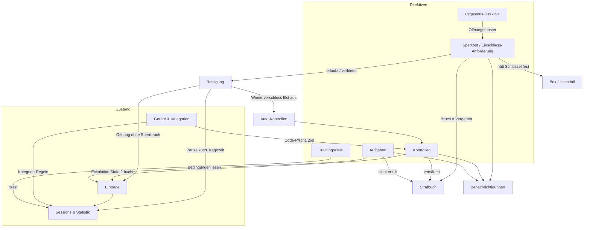

# Funktionsmodell

Was der Tracker kann, was sich einstellen lässt und — vor allem — **was worauf wirkt**.

Diese Sammlung beantwortet nicht „welche Features gibt es". Das liesse sich aus der Oberfläche
ablesen. Sie beantwortet die Frage, die im Betrieb tatsächlich stellt: *warum hat sich das System
gerade so verhalten, obwohl der Schalter doch anders steht.* Solche Fälle entstehen fast nie aus
einem Fehler in einer Mechanik, sondern aus dem Zusammenspiel zweier Mechaniken, die je für sich
richtig arbeiten.

Adressat sind Betreiber und Entwickler. Für die Keyholder-KI gibt es die eigene, bewusst anders
geschnittene Referenz `src/lib/mcpModelDoc.ts` (Tool `explain_model`); für den Sub die Regel-Seite
in der App. Wo sich Aussagen überschneiden, ist diese Sammlung die technische, jene die
handlungsleitende Fassung.

## Aufbau

| Datei | Inhalt |
|---|---|
| [stellschrauben.md](stellschrauben.md) | **Generiert.** Jedes Feld, das Verhalten steuert: Typ, Default, wer schreiben darf, worauf es wirkt, wo die Regel im Code steht. |
| [10-sperrzeit.md](10-sperrzeit.md) | Steckbrief Sperrzeit und Verschluss-Anforderung |
| [20-reinigung.md](20-reinigung.md) | Steckbrief Reinigung |
| [30-kontrollen.md](30-kontrollen.md) | Steckbrief Kontrollen (manuell, automatisch, Eskalation) |
| [90-kollisionen.md](90-kollisionen.md) | **Vorrang- und Kollisionsregeln.** Was gewinnt, wenn zwei Regeln gleichzeitig gelten. |

Die Steckbriefe folgen alle demselben Raster (Zweck, Stellschrauben, Auslöser, Wirkt auf,
Unterdrückt von, Sichtbarkeit, Code, Tests). Das ist Absicht: eine Frage lässt sich so in jedem
Steckbrief an derselben Stelle beantworten, und eine leere Rubrik ist ein Befund, kein Formfehler.

## Wo anfangen

- **„Was kann ich einstellen?"** → [stellschrauben.md](stellschrauben.md), nach Domäne sortiert.
- **„Warum ist das passiert?"** → [90-kollisionen.md](90-kollisionen.md). Dort stehen die Fälle, in
  denen zwei richtige Regeln ein überraschendes Ergebnis produzieren.
- **„Wie funktioniert X?"** → der Steckbrief der Mechanik.

## Systemkarte

Die Mechaniken und ihre Kanten. Eine Kante heisst „liest" oder „löst aus", nicht „ruft auf" — es ist
eine Wirkungskarte, kein Abhängigkeitsgraph des Codes.



Noch ohne Steckbrief (die Karte nennt sie, damit die Lücke sichtbar bleibt): Aufgaben,
Trainingsziele, Orgasmus-Direktive, Geräte/Kategorien, Box, Strafbuch, Nachrichten,
Benachrichtigungen, Sessions/Statistik.

## Pflege

Der generierte Teil hält sich selbst ehrlich:

```bash
npm run funktionsmodell
```

Erzeugt `stellschrauben.md` aus `prisma/schema.prisma` (Form: Feld, Typ, Default) und
`src/lib/funktionsmodellRegistry.ts` (Bedeutung: wer schreibt, worauf wirkt es, wo steht die Regel).
`funktionsmodellDoc.test.ts` lässt `npm test` fehlschlagen, wenn

- ein Feld der geprüften Modelle keinen Registry-Eintrag hat,
- ein Registry-Eintrag auf ein Feld zeigt, das es nicht mehr gibt,
- oder die eingecheckte Markdown-Datei nicht mehr zum aktuellen Stand passt.

Damit kann das Register nicht stillschweigend veralten — der übliche Tod einer
Funktionsdokumentation. Die Prosa-Steckbriefe sind von Hand gepflegt und geniessen diesen Schutz
nicht; sie sind dafür auch nicht der Ort für Zahlen, die sich ändern (die stehen im Register).

**Ein Modell in die Vollprüfung aufnehmen:** Name in `FM_SCANNED_MODELS` eintragen und `npm test`
laufen lassen — der Test nennt danach jedes Feld, das noch einen Eintrag braucht. Heute geprüft:
`User`, `Device`, `DeviceCategory`, `VerschlussAnforderung`, `KontrollAnforderung`,
`NotificationPreference`.
